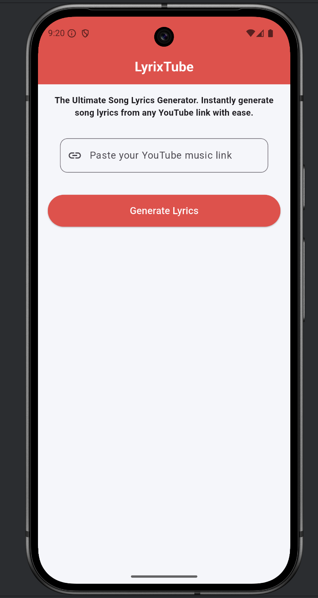
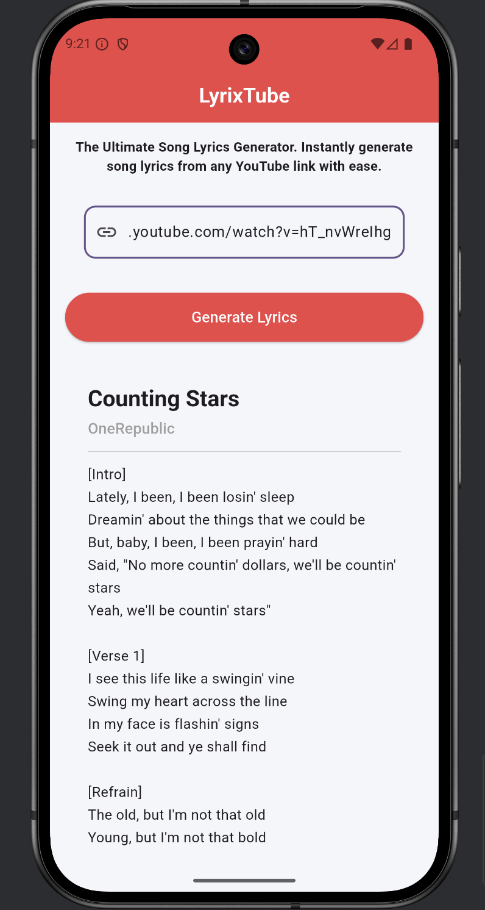

# 🎵 LyrixTube

> The Ultimate Song Lyrics Generator. Instantly generate song lyrics from any YouTube link with ease.

LyrixTube is a full-stack application that extracts song information from YouTube music links and retrieves accurate lyrics using the Genius Lyrics API. 

Built with Flutter for a beautiful UI and Node.js/Express for a robust backend.

## ✨ Features

- 🎬 **YouTube Integration**: Extract song metadata directly from YouTube music links
- 📝 **Instant Lyrics**: Fetch accurate lyrics from Genius Lyrics API
- 🔄 **State Management**: Provider pattern for efficient state management
- 🌐 **Cross-Platform**: Support for iOS, Android, Web, macOS, Linux, and Windows

## 🛠️ Tech Stack

### Frontend
- **Framework**: Flutter 3.6.0+
- **Language**: Dart
- **State Management**: Provider (v6.1.5+)
- **HTTP Client**: Dio (v5.9.0)
- **UI Components**: 
  - Material 3 Design
  - Shimmer loading animations

### Backend
- **Runtime**: Node.js
- **Framework**: Express.js (v5.2.1)
- **HTTP Client**: Axios (v1.13.3)
- **Music API**: 
  - Genius Lyrics (v4.4.7)
  - play-dl (v1.9.7) for YouTube extraction
- **Utilities**: CORS, dotenv for environment configuration

## Demo

| Home | Lyrics |
|------|--------|
|  |  |


## 📋 Project Structure

```
LyrixTube/
├── lyrix_tube_app/           # Flutter Frontend Application
│   ├── lib/
│   │   ├── main.dart         # App entry point
│   │   ├── screen/
│   │   │   └── lyrics_screen.dart    # Main UI screen
│   │   └── provider/
│   │       └── lyrics_provider.dart  # State management logic
│   ├── android/              # Android native code
│   ├── ios/                  # iOS native code
│   └── pubspec.yaml          # Flutter dependencies
│
├── server/                   # Node.js Backend
│   ├── index.js              # Server entry point
│   ├── controllers/
│   │   └── lyrics.js         # Lyrics controller logic
│   ├── routes/
│   │   └── allRoutes.js      # API route definitions
│   ├── services/
│   │   └── lyrics.js         # Lyrics service/business logic
│   ├── utils/
│   │   └── formatLyrics.js   # Lyrics formatting utilities
│   └── package.json          # Node dependencies
│
└── README.md                 # This file
```

## 🚀 Getting Started

### Prerequisites

- **Flutter**: Version 3.6.0 or higher
- **Node.js**: Version 14 or higher
- **npm** or **yarn**: Package manager for backend
- **Git**: For cloning the repository

### Installation

#### 1. Clone the Repository

```bash
git clone https://github.com/AritraC1/LyrixTube.git
cd LyrixTube
```

#### 2. Backend Setup

```bash
# Navigate to server directory
cd server

# Install dependencies
npm install

# Create .env file (if needed for API keys)
touch .env

# Start the development server
npm start
```

The backend server will run on `http://localhost:3000` (or the port specified in your .env).

#### 3. Frontend Setup

```bash
# Navigate to Flutter app directory
cd lyrix_tube_app

# Get Flutter dependencies
flutter pub get

# Run on Android (requires Android Studio)
flutter run -d android

# Run on iOS (requires macOS and Xcode)
flutter run -d ios
```

## 📱 Usage

1. **Launch the App**: Open LyrixTube on your device
2. **Paste YouTube Link**: Enter a YouTube music video link in the input field
3. **Generate Lyrics**: Tap the "Generate Lyrics" button
4. **View Results**: Wait for the lyrics to load and display
5. **Loading State**: The app shows a shimmer loading animation while fetching data

### Example YouTube Links

- `https://www.youtube.com/watch?v=dQw4w9WgXcQ` (Rick Astley - Never Gonna Give You Up)
- `https://www.youtube.com/watch?v=hT_nvWreIhg` (OneRepublic - Counting Stars)

## 🔌 API Endpoints

### Backend API Routes

| Method | Endpoint | Description | Example |
|--------|----------|-------------|---------|
| POST | `/api/generate-lyrics` | Get lyrics for a song | `POST http://localhost:3000/api/generate-lyrics` |

#### Request Format
```json
{
  "link": "https://www.youtube.com/watch?v=hT_nvWreIhg",
}
```

#### Response Format
```json
{
  "success": true,
  "data": {
     "artist": "OneRepublic",
     "song": "Counting Stars",
     "lyrics": "[Intro]\nLately, I been, I been losin' sleep\nDreamin' ..."
  }
}
```

## 🔐 Environment Variables

### Backend (.env)
```
PORT=3000
GENIUS_API_KEY=your_genius_api_key_here
```

Get your Genius API key: [genius.com/api-clients](https://genius.com/api-clients)


## 📦 Building for Production

### Android APK
```bash
flutter build apk --release
# Output: build/app/outputs/flutter-apk/app-release.apk
```

### iOS App
```bash
flutter build ios --release
# Requires further processing with Xcode
```

## 📞 Support

If you encounter any issues or have questions, please [open an issue](https://github.com/yourusername/LyrixTube/issues) on GitHub.

---